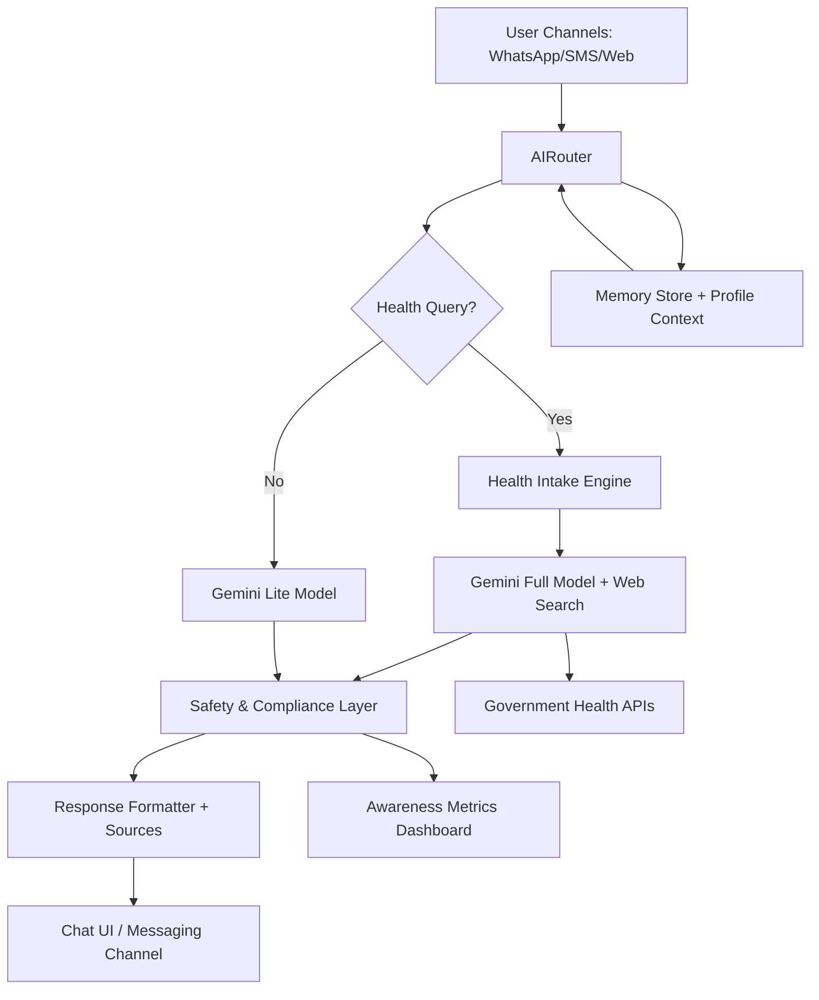

# #  Ojas Health Aid (aka MedTrack on WhatsApp)  Ojas Health Aid (aka MedTrack on WhatsApp)
> **AI-driven multilingual public health companion for preventive care, disease awareness, and vaccination guidance.*

---

## 🧾 Brief Overview

Ojas Health Aid is an AI-powered chatbot designed for rural and semi-urban communities. It delivers **safe**, **empathetic**, and **multilingual** guidance on preventive healthcare, emerging outbreaks, vaccination schedules, and symptom education. The system integrates with government health databases to provide actionable alerts and boosts health awareness through conversational outreach channels like WhatsApp and SMS.

---

## 🤔 Why Ojas / MedTrack?

1. **🌍 Community-Centric** – Tailored for India's diverse linguistic and cultural landscape.
2. **⚕️ Safety-First Guidance** – Focuses on awareness and triage, nudging users toward professional care.
3. **📡 Real-Time Intelligence** – Syncs with verified health datasets for outbreak alerts and vaccination drives.
4. **📈 Proven Impact Goal** – Targets 80% answer accuracy and a 20% awareness lift in served communities.

---

## ✨ Key Features

|      | Capability | Description |
|------|------------|-------------|
| 🗣️ | **Multilingual Conversations** | Supports major Indian languages with empathetic, culturally aware responses. |
| 🩺 | **Preventive Health Guidance** | Educates on disease symptoms, vaccines, lifestyle, and early interventions. |
| 🧭 | **Smart Intake & Triage** | Progressive question flow to assess severity and recommend next steps. |
| 🚨 | **Emergency Protocols** | Detects high-risk symptoms and suggests nearby emergency services. |
| 🔗 | **Government API Integrations** | Pulls vaccination schedules, epidemic alerts, and public health advisories. |
| 🧠 | **Safety Guardrails** | Enforces medical ethics, sanitizes responses, and maintains privacy compliance. |
| 🖼️ | **Media & Education Hub** | Delivers infographics, reminders, and community health resources. |
| 📊 | **Insights & Reporting** | Tracks awareness metrics, usage patterns, and community impact goals. |

---

## 🛠️ Tech Stack

### 💻 Frontend
- React 18 + TypeScript
- Vite build tooling
- Tailwind CSS + shadcn/ui + Radix UI
- React Router DOM, React Hook Form + Zod
- Framer Motion animations
- TanStack Query for data fetching
- Recharts for analytics dashboards
- Remark/React Markdown for rich text

### 🧠 AI & Intelligence Layer
- Google Gemini 2.5 Flash (Lite + Full)
- AI Router for query classification and routing
- Health Intake, Text Analysis, Search integration services
- Safety prompts, content sanitization, and memory management

### ☁️ Backend & Infrastructure
- Firebase Authentication, Firestore, Cloud Storage
- Express dev bot & Firebase Hosting
- Google Custom Search API
- Text-to-Speech service for voice responses

### 🧰 Tooling & DevOps
- TypeScript 5.8
- ESLint 9
- npm / bun scripts
- Smoke tests via tsx
- CI-ready architecture diagrams and documentation

---

## 🏗️ Architecture Snapshot

---

## 🔍 Core Components

- **AIRouter**: Classifies intent, chooses models, orchestrates follow-ups.
- **Health Intake Engine**: Generates progressive symptom questions.
- **Safety & Compliance Module**: Applies medical guardrails and sanitizes content.
- **Memory Store**: Syncs contextual history across local and cloud storage.
- **Government API Integrations**: Fetches outbreak alerts, vaccination data, and facility directories.

---

## 👥 Team

- 🧭 **Product Lead** – Vision, metrics, community partnerships
- 🧠 **AI/ML Lead** – Model orchestration, safety, and routing logic
- 🎨 **Frontend Lead** – Multilingual UI, accessibility, and channel support
- 🛡️ **Backend & Integrations Engineer** – Firebase, Express, API integrations
- 🔐 **Compliance Analyst** – Medical accuracy, privacy (HIPAA-aligned) governance
- 📢 **Outreach & UX Research** – Field feedback, adoption programs, behavior change tracking

*(Add actual names and contact details as appropriate.)*

---

## 🖼️ Gallery

| Preview | Description |
|---------|-------------|
| Landing | Landing page highlighting key benefits and call-to-action. |
| ChatUI | Multilingual chat interface with symptom intake prompts. |
| Emergency | Emergency workflow showcasing nearby facilities and contacts. |
| Dashboard | Awareness metrics and community impact dashboard. |

*(Replace placeholders with actual assets stored under docs/gallery/.)*

---

## 🔗 Useful Links

- 🌐 **Live Demo / Deployment**: TBD – add cloud URL or WhatsApp entry point
- 🎥 **Product Walkthrough**: TBD – link to demo video
- 📄 **Architecture & Workflows**: design.md
- 📋 **Project Tracker**: TBD – Notion/Jira/Trello board
- 📣 **Community Awareness Kit**: TBD – content repository link

---

## 🎯 Expected Outcomes

- Reach **80% accuracy** on health queries by leveraging Gemini models + curated datasets.
- Deliver **20% uplift** in preventive health awareness across target communities.
- Provide **real-time outbreak alerts** via government API integrations.
- Maintain **privacy and safety compliance** with robust guardrails and HIPAA-aligned practices.

---

## 📡 Future Enhancements

- Expand IVR/voice and dialect-specific support.
- Automate vaccination reminders and appointment scheduling.
- Integrate offline-first data capture for low-connectivity regions.
- Add specialist referral network and continuous medical content updates.

